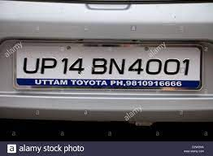

## UCS757 Building Innovative Systems
## Project 2
# Detecting license number plate from image with OpenCV in Python.
Here our objective is to detect number plate using openCV

### Following are the steps I followed to convert image into cartoon
1. Importing the required modules.
2. Getting the image from the user 
3. Resizing and transforming an image to grayscale
4. Blurring a grayscale image
5. Retrieving the edges of an image
6. Detecting contours on our image
7. Masking the entire picture except for the place where the number plate is
8. Saving the image

### Live Link
https://git.heroku.com/nitish-license.git

### Input Image                                                                       
 

### Output Image
 

### Flowchart
 

## Submitted by :- 
### Nitish Jain
### 101803154
### COE8
